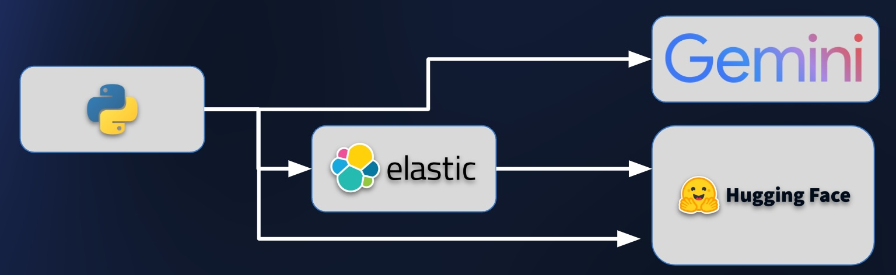

# GenAI Dev Workshop - Colab

Welome to this Elastic GenAI Workshop for Developers.  We'll be using Google Colab as our Python development environement and different back end services to compare and contrast ways of creating embedding models, implementing semantic search, and using Gemini

## To run this lab you will need:
* a workshop key from your instructor to load the environment variables required to run these notebooks
* your own Google account to use the free Colab execution environment
* A Gemini API key

## Instructions

Once the environment loads, the first step in the notebook will try to load the environment variables required to run the workshop. Please enter the workshop key provided to you by in the instructor.